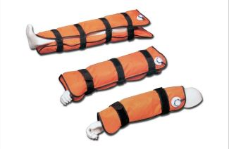
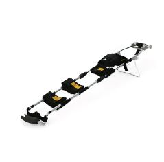
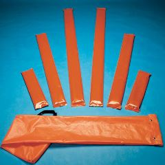
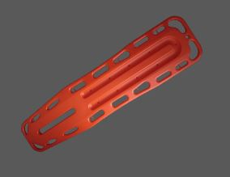
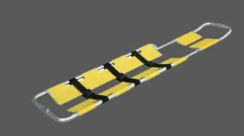
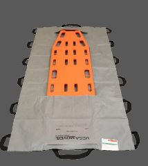

# Splinting and Spinal Immobilization

The following program will give you a deeper understanding on how Bones work, how different fractures can occur, how to deal with each separate kind of fracture and how to assess and treat spinal injuries. It will go over the spinal cord, displaying the importance of spinal immobilization as well as a multitude of other things.

## Splinting

Broken bones are a relatively daunting injury but pretty straightforward to treat. We carry a multitude of types of splints that you can use to splint a wound. Those of which are described below:
- Vacuum Splint  
Primarily used for larger extremities
- Traction Splint 
Used for Tibia and Femur fractures exclusively
- Board Splint 
Used primarily for legs
- Sam Splint 
Used for arms, small extremities or legs

## Spinal Cord Immobilization

To immobilize the spinal cord you can turn to multiple different packaging methods. These being:

- Backboard 
Used for spinal immobilization, requires the patient to be rolled onto the backboard.
- Scoop Stretcher 
Used for spinal immobilization, does not require the patient to be rolled onto the stretcher.
- Megamover 
User for spinal immobilization, requires the patient to be rolled onto stretcher. Typically used for oversized patients or in areas of tight access.
- C-Collar 
Used for every situation to immobilize the neck and head.

