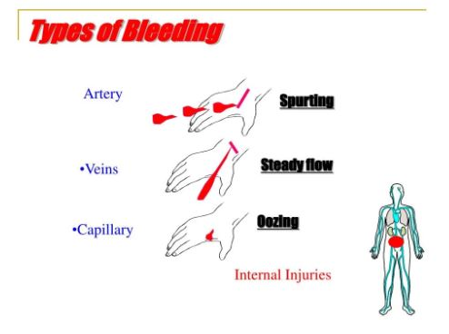
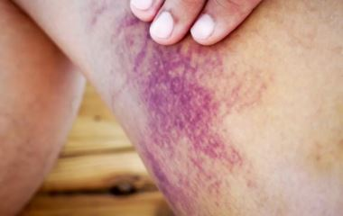

# Trauma

The following program will prepare you to perform hemorrhage treatment as well as handle other kinds of traumatic injuries such as head trauma, crush syndrome and much more. It will also teach you about blood clotting and aid you in determining the priority for treatment of various different bleeds.

## External Bleeding

There are multiple locations a patient can be bleeding from, some of these locations severe, others less severe. We will go over how to treat every possible scenario so you aren’t lost when you encounter one of the most common medical complaints EMTs receive.

**Minor Bleeding:**
- Cover the wound with gauze or a bandage. If applicable, apply a band-aid.

**Major Bleeding to an Extremity (Arms/Legs):**
- Apply direct pressure;
- Apply a tourniquet if bleeding can not be controlled.

**Major Bleeding to the torso, neck or head:**
- Apply direct pressure;
- Wrap the wound with Elastic Bandages;

**Artery Bleeds** - Considered a Major Bleed. Has priority over other types of bleeding.  
**Vein Bleeds** - Also considered a Major Bleed. Has less priority over Artery bleeds as generally less blood seeps out.  
**Capillary Bleeds** - One of the more common types of bleed, can generally clot on it’s own.

## Internal Bleeding

Internal bleeding tends to be harder to identify in comparison with External bleeding as you typically can not see the blood coming out from its source. To identify if a patient is bleeding internally, look for these signs:

- Hematoma;
- Abdominal bruising;
- Discoloration;
- Tenderness;
- Rigidity;
- Distended abdomen;
- Bleeding from mouth, rectum and other body orifice;
- Vomiting blood (a red or dark color);
- Stools with blood.

If you have successfully identified a patient with internal bleeding, request an ALS intercept if there are signs of severe blood loss, and transport to a hospital as quickly as possible. Give oxygen as needed.  
**Do NOT give blood thinning medications such as aspirin or nitroglycerin if the patient is bleeding.**

## Burn Management

Burns injuries tend to be extremely time sensitive and critical to treating as quickly as possible due to the possibility of infection or sepsis. There are multiple types of burns, each ranking from minor to major.

1st Degree burns - The most minor type of burn, causes damage to the first layer of skin. The most common type of burn.

2nd Degree burns - Regarded as more critical than the 1st degree burns, it damages the second layer of skin.

3rd Degree burns - The most critical type of burn, it damages the first and second layers of skin as well as the underlying tissue.

When treating these burn injuries you must take into account the severity of the burn. To treat burns you can use dry sterile burn sheets or wet sterile burn sheets. 

In the event of a minor burn, use a wet sterile burn sheet.  
In the event of a major burn, use a dry sterile burn sheet.  

## Taser Prongs and Gunshot Wounds

**Taser Prongs**

If a patient has been tased in a non-critical body area, do the following to remove the prongs:
- Make sure the prongs are disconnected from the taser to prevent shocks.
- Remove one prong at a time:
    - Stabilize the skin surrounding the prong
    - Firmly grasp the prong and with one smooth motion pull the prong from the patient’s skin
    - Clean the wound and cover with a bandaid.
- If the patient has been tased in a critical body area (artery, airway, genital area, eyes, etc.):
    - Stabilize the prong and prevent it from moving.
    - If the prong struck the airway, ensure it’s not causing a blockage. If it is, request an ALS intercept.
    - Transport the patient to the nearest hospital.

**Gunshot wounds**

Look for an entry and exit wound. If there is no exit wound, this means the bullet is still inside the patient. If there is no exit wound attempt to keep the patient as still as possible. Treat gunshot entry and exit wounds like bleeds.  
If the GSW is to the chest area, apply a chest seal and check for signs of Pneumothroax.

