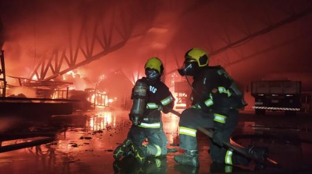
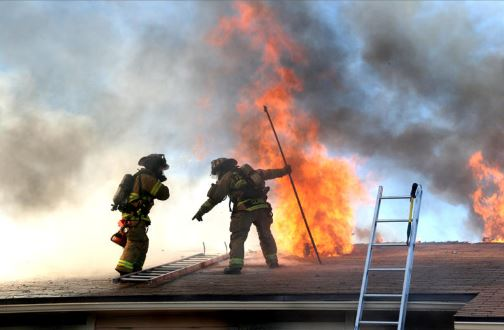

# Operations

## Extrication and Extraction

**Extrication**  
The act of performing an extrication is to remove someone from a confined space such as a motor vehicle of which the person(s) is unable to escape. During an extrication, medics should assist the patient while the ladder or engine unit is working on extricating them.

**Extraction**  
The act of performing an extraction is to remove someone from a general area of which they are unable to escape. During an extraction the top priority should be the removal of the patient from the area of danger such as a structure fire.

## Building Extrication Operations

When assigned with Primary Search or Secondary Search, you must enter the building while it is still burning and attempt to navigate through the fire, checking every room for any civilians within that may be stuck.  
If you encounter a patient, advise Scene Command of a patient found and work your way out of the building with the patient in hand. Once the patient has been turned over to medics return to the building until you have completed your search or Scene Command says otherwise. When moving they please understand they have no PPEs and give them a mask if possible 

Things to keep in mind:
- Primary or Secondary search is performed with 2 people, minimum.
- When performing primary search, the pair must remain together at all times.
- Do not run through fire. If your passage is impeded by fire find another way in.
- If the fire develops to cover your exit while you are inside, call for a panic. 

## Primary Attack

Primary attack is the initial attack on the fire, done by the Engines. It consists of rolling out a hose line and two people, one nozzle man and one supporting (standing behind and holding the hose up).  
Primary Attack often tends to be offensive, which means you may go interior if it is safe to do so, but when scene command tells you to defensive you must vacate and attack from the exterior. If you see signs of structural collapse while you are inside tell scene command and vacate immediately.

## Exterior Attack

Exterior Attack is most commonly done by Ladders or Quints. Exterior attacks involve, as the name implies, fighting the fire from the outside of the structure. Exterior attack, also often called defensive operations involve actively fighting the fire whilst maintaining a safe distance from the fire.

When performing Exterior Attack you must not go closer than 20 feet from the structure nor can you attack a different side of the structure without advising command first.

## Ventilation

Ventilation is done exclusively by ladder crews. Ventilation is only necessary when fighting structure fires and not brush fires. To successfully ventilate a structure you use the aerial in the ladder to access the roof of the building. You then carefully drill and poke holes through the building roof to allow the fire to head upwards and not outwards. This allows for a more concentrated and controllable fire.

## Overhaul

Overhaul is performed to check that there isn’t any hidden flames or embers that could possibly reignite the once burning structure or area. In an engine or ladder you have a TIC (Thermal Imaging Camera) that you can use to check for any hotspots inside walls, vents or flooring. If you do encounter hotspots, break down whatever may be covering it and spray it down with water to ensure the fire is put out.

## MVA Operations

**Vehicle Stabilization**

To stabilize a vehicle there are multiple tools you can use:
- Struts
- Cribbing
- Chocks

If a vehicle is leaning on it’s side or threatening falling onto a certain side you can stabilize the weaker end using Struts.

Cribbing is used to ensure the vehicle does not rock from side to side. 
Chocks are used to ensure the vehicle does not roll around on it’s wheels. 
Once you have done with make sure to disconnect battery and check for leaks, if it is leaking use drying agent or kitty litter/sand if big enough leak. 

**Patient extrication**

Extrication is the removal of a patient from a confined space such as a vehicle. While performing an extrication medics are able to interact with the patient to determine their level of severity and to administer initial medical aid. 
To extricate someone you must first stabilize the vehicle. If you are unable to open the door use spreaders to force it open or off entirely. Then, cut the seatbelt and place a backboard and C-Collar on the patient to prevent spinal injury. Only then can you remove them from the vehicle.

